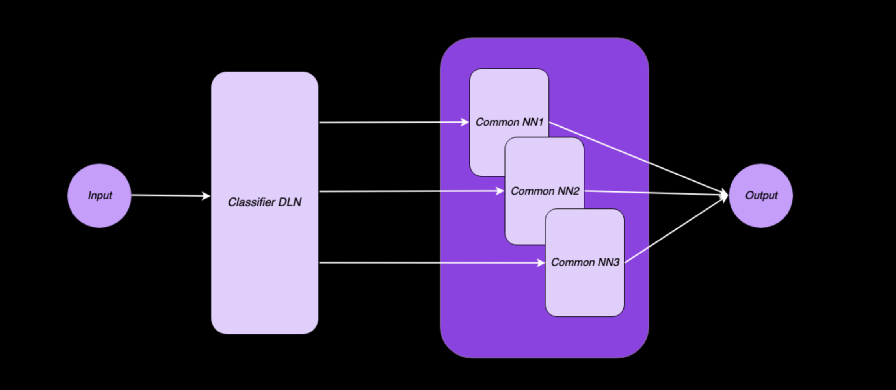

# Project DLC

Ziel ist es einen Prototypen des Decentralized Deep Learning Clusters zu erstellen.
Dieser soll im Rahmen der Lehveranstaltung Computational Intelligence präsentiert werden.

## Architektur


https://prezi.com/p/dvlbht6tgpa2/stacked-neural-networks/

## Datasets

+ Cat-vs-Dog Data: https://www.kaggle.com/c/dogs-vs-cats
+ Dog-Breed Data: https://www.kaggle.com/c/dog-breed-identification


## Stack

+ kafka (2.11-2.2.0) - broker system
+ python (3.6) - scripting language
+ tensorflow (1.0.0) - platform for machine learning
+ keras (2.2.4) - neural networks API


## Installation

##### Start zookeeper + kafka
```sh

$ kafka_node> bin/zookeeper-server-start.sh config/zookeeper.properties
$ kafka_node> bin/kafka-server-start.sh config/server.properties

```

##### Create topic
```sh

$ kafka_node> bin/kafka-topics.sh --create --zookeeper localhost:2181 --replication-factor 1 --partitions 1 --topic dog

```

##### Check created topics
```sh

$ kafka_node> bin/kafka-topics.sh --list --zookeeper localhost:2181

```

##### Classifier Model Endpoint 

```sh
$ > cd project
$ > python3 CatDogModel.py
```

##### Common Model Endpoint 

```sh
$ > cd project
$ > python3 DogBreedModel.py
```


